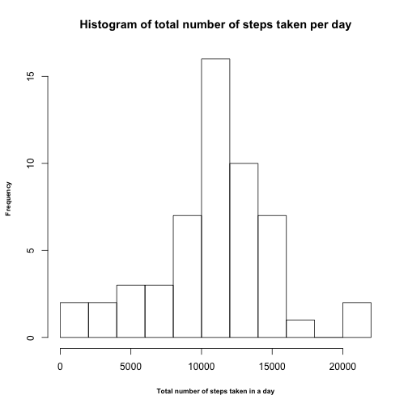
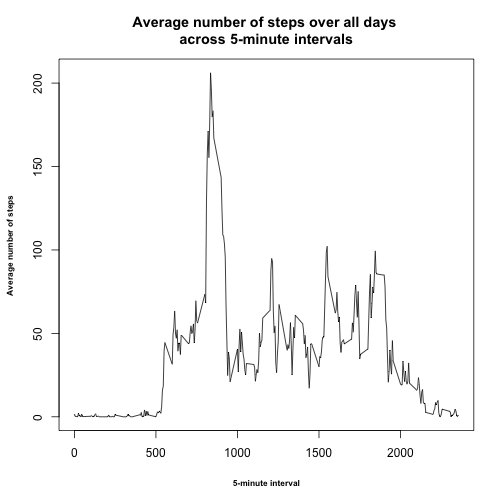
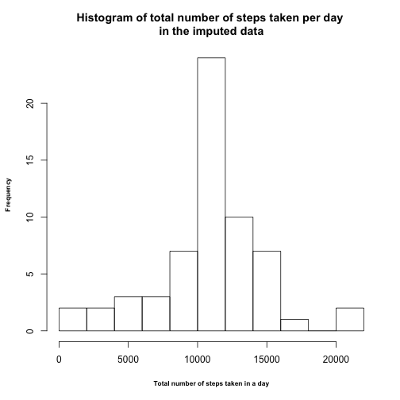
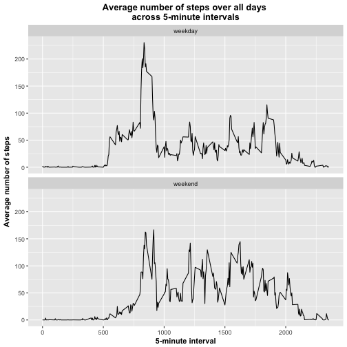

Reproducible Research : Course Project 1
=========================================

Load libraries

```r
library(ggplot2)
library(knitr)
```


###Loading and preprocessing the data
1. Load the data

```r
activity <- read.csv("activity.csv")
head(activity)
```

```
##   steps       date interval
## 1    NA 2012-10-01        0
## 2    NA 2012-10-01        5
## 3    NA 2012-10-01       10
## 4    NA 2012-10-01       15
## 5    NA 2012-10-01       20
## 6    NA 2012-10-01       25
```

2. Process/transform the data (if necessary) into a format suitable for your analysis.

The data seems to be in a good format. So, I did not transform it.

###What is mean total number of steps taken per day?
For this part of the assignment, you can ignore the missing values in the dataset.

1. Calculate the total number of steps taken per day

```r
steps_per_day <- aggregate(steps ~ date, activity, sum)
steps_per_day
```

```
##          date steps
## 1  2012-10-02   126
## 2  2012-10-03 11352
## 3  2012-10-04 12116
## 4  2012-10-05 13294
## 5  2012-10-06 15420
## 6  2012-10-07 11015
## 7  2012-10-09 12811
## 8  2012-10-10  9900
## 9  2012-10-11 10304
## 10 2012-10-12 17382
## 11 2012-10-13 12426
## 12 2012-10-14 15098
## 13 2012-10-15 10139
## 14 2012-10-16 15084
## 15 2012-10-17 13452
## 16 2012-10-18 10056
## 17 2012-10-19 11829
## 18 2012-10-20 10395
## 19 2012-10-21  8821
## 20 2012-10-22 13460
## 21 2012-10-23  8918
## 22 2012-10-24  8355
## 23 2012-10-25  2492
## 24 2012-10-26  6778
## 25 2012-10-27 10119
## 26 2012-10-28 11458
## 27 2012-10-29  5018
## 28 2012-10-30  9819
## 29 2012-10-31 15414
## 30 2012-11-02 10600
## 31 2012-11-03 10571
## 32 2012-11-05 10439
## 33 2012-11-06  8334
## 34 2012-11-07 12883
## 35 2012-11-08  3219
## 36 2012-11-11 12608
## 37 2012-11-12 10765
## 38 2012-11-13  7336
## 39 2012-11-15    41
## 40 2012-11-16  5441
## 41 2012-11-17 14339
## 42 2012-11-18 15110
## 43 2012-11-19  8841
## 44 2012-11-20  4472
## 45 2012-11-21 12787
## 46 2012-11-22 20427
## 47 2012-11-23 21194
## 48 2012-11-24 14478
## 49 2012-11-25 11834
## 50 2012-11-26 11162
## 51 2012-11-27 13646
## 52 2012-11-28 10183
## 53 2012-11-29  7047
```

2. Make a histogram of the total number of steps taken each day

```r
hist(steps_per_day$steps, breaks=15, xlab="Total number of steps taken in a day", main="Histogram of total number of steps taken per day", cex.lab=0.7, font.lab=2)
```



3. Calculate and report the mean and median of the total number of steps taken per day

```r
mean(steps_per_day$steps)
```

```
## [1] 10766
```
Mean of the total number of steps taken per day is 10766.


```r
median(steps_per_day$steps)
```

```
## [1] 10765
```
Median of the total number of steps taken per day is 10765.


###What is the average daily activity pattern?

1. Make a time series plot (i.e. 𝚝𝚢𝚙𝚎 = "𝚕") of the 5-minute interval (x-axis) and the average number of steps taken, averaged across all days (y-axis).

```r
time_series_data <- aggregate(steps ~ interval, data=activity , mean)
plot(time_series_data, type="l", xlab="5-minute interval", ylab="Average number of steps", main ="Average number of steps over all days \nacross 5-minute intervals", font.lab=2, cex.lab=0.7)
```



2. Which 5-minute interval, on average across all the days in the dataset, contains the maximum number of steps?

```r
time_series_data[which(time_series_data$steps == max(time_series_data$steps) ),]
```

```
##     interval  steps
## 104      835 206.17
```
The 835 interval, on average across all the days in the dataset, contains the maximum number of steps.

###Imputing missing values

1. Calculate and report the total number of missing values in the dataset (i.e. the total number of rows with 𝙽𝙰s)

```r
sum(is.na(activity))
```

```
## [1] 2304
```
Total number of missing values in the dataset is 2304.

2. Devise a strategy for filling in all of the missing values in the dataset.

All the NAs in the dataset are in the steps column. So I chose to impute them with the mean for that 5-minute interval.

```r
mean_five_minute <- aggregate(steps ~ interval, activity, mean)
make_imputed_data <- function(x){
  imputed_data <- x
  for ( i in 1:nrow(imputed_data)){
    if(is.na(imputed_data[i,]) == TRUE){
      interval <- imputed_data[i,3]
      mean <- mean_five_minute[which(mean_five_minute$interval == interval),2]
      imputed_data[i,1] <- mean
    }
  }
  return(imputed_data)
}
```


3. Create a new dataset that is equal to the original dataset but with the missing data filled in.

```r
imputed_data <- suppressWarnings(make_imputed_data(activity))
head(imputed_data)
```

```
##      steps       date interval
## 1 1.716981 2012-10-01        0
## 2 0.339623 2012-10-01        5
## 3 0.132075 2012-10-01       10
## 4 0.150943 2012-10-01       15
## 5 0.075472 2012-10-01       20
## 6 2.094340 2012-10-01       25
```
imputed_data is the new dataset with the missing data filled in.

4. Make a histogram of the total number of steps taken each day and Calculate and report the mean and median total number of steps taken per day. Do these values differ from the estimates from the first part of the assignment? What is the impact of imputing missing data on the estimates of the total daily number of steps?

Firstly, I calculated the total number of steps taken each day in the imputed dataset.

```r
steps_per_day_imputed <- aggregate(steps ~ date, imputed_data, sum)
head(steps_per_day_imputed)
```

```
##         date steps
## 1 2012-10-01 10766
## 2 2012-10-02   126
## 3 2012-10-03 11352
## 4 2012-10-04 12116
## 5 2012-10-05 13294
## 6 2012-10-06 15420
```

The histogram is :

```r
hist(steps_per_day_imputed$steps,  breaks=15, xlab="Total number of steps taken in a day", main="Histogram of total number of steps taken per day \nin the imputed data",  cex.lab=0.7, font.lab=2)
```




```r
mean(steps_per_day_imputed$steps)
```

```
## [1] 10766
```
Mean of the imputed dataset is 10766.


```r
median(steps_per_day_imputed$steps)
```

```
## [1] 10766
```
Median of the imputed dataset id 10766.

The impact on the imputation is that the mean remains the same as of the original dataset but there is a slight change in the median.

###Are there differences in activity patterns between weekdays and weekends?

1. Create a new factor variable in the dataset with two levels – “weekday” and “weekend” indicating whether a given date is a weekday or weekend day.

```r
imputed_data$day_of_week <- weekdays(as.Date(imputed_data$date))
imputed_data$day_of_week[imputed_data$day_of_week  %in% c('Saturday','Sunday') ] <- "weekend"
imputed_data$day_of_week[imputed_data$day_of_week != "weekend"] <- "weekday"
imputed_data$day_of_week <- as.factor(imputed_data$day_of_week)
```

2. Make a panel plot containing a time series plot (i.e. 𝚝𝚢𝚙𝚎 = "𝚕" ) of the 5-minute interval (x-axis) and the average number of steps taken, averaged across all weekday days or weekend days (y-axis).

```r
imputed_time_series_data <- aggregate(steps ~ interval + day_of_week, data=imputed_data , mean)

ggplot(imputed_time_series_data, aes(x=interval, y=steps)) + geom_line() + facet_wrap(~day_of_week, ncol=1) + labs(x="5-minute interval", y="Average number of steps", title="Average number of steps over all days \nacross 5-minute intervals") + theme(axis.title=element_text(face="bold",size="11"), plot.title = element_text(size=13, face="bold", hjust = 0.5)) 
```


